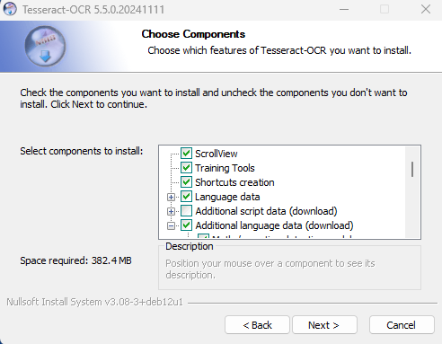
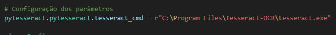
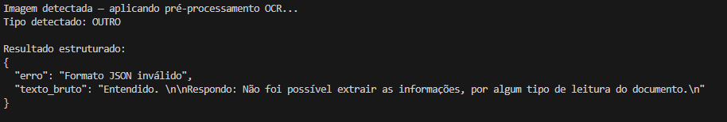
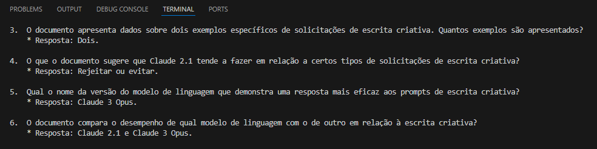
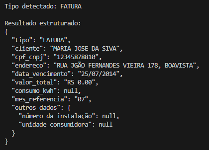

# Prova de Conceito (POC) & Benchmark de Modelos SLM

[Abrir Dossiê](dossie/dossie-de-pesquisa.pdf)

Este repositório contém dois scripts principais que demonstram a integração entre **OCR (Reconhecimento Óptico de Caracteres)**, **RAG (Retrieval-Augmented Generation)** e **SLMs (Small Language Models)** para análise de documentos e avaliação de desempenho. Além de uma pasta com os benchmarks do Dossiê de Pesquisa.

- **`poc.py`** → Prova de Conceito de extração de informações e geração de perguntas automáticas.
- **`benchmark_rag.py`** → Benchmark de desempenho, acurácia e consumo de recursos dos modelos SLM.

## Visão Geral

Este projeto tem dois objetivos principais:

1. **Automatizar a leitura e extração de informações** de documentos (PDFs, CNHs, faturas etc.) usando OCR e SLMs.
2. **Avaliar desempenho e acurácia** de diferentes modelos SLM em recuperação e informação utilizando RAG.

## `poc.py` – Extração e Geração de Perguntas

O script **`poc.py`** processa documentos de diferentes formatos (imagens e PDFs) para:

- Extrair informações estruturadas via **OCR + SLM**;
- Gerar automaticamente perguntas e respostas sobre PDFs usando **RAG**.

### Fluxo de Execução

1. **Detecção do tipo de documento** (imagem ou PDF);  
2. **Extração de texto**:  
   - Imagens → `pytesseract` (OCR);  
   - PDFs → `PyPDFLoader` (LangChain);  
3. **Classificação do documento** (CNH, Fatura, Outro);  
4. **Montagem do prompt apropriado**;  
5. **Envio ao modelo LLM (Ollama)**;  
6. **Formatação do resultado em JSON**;  
7. **Para PDFs:** geração de perguntas e respostas via **RAG**.

## `benchmark_rag.py` – Benchmark e Avaliação de Modelos

O script **`benchmark_rag.py`** executa testes de desempenho e qualidade de resposta de um pipeline **RAG** utilizando:

- Documentos PDF reais;  
- Perguntas e respostas esperadas (armazenadas em Excel);  
- Métricas de tempo, consumo e similaridade semântica.

### Etapas Principais

1. Leitura e limpeza dos PDFs;  
2. Divisão dos textos em *chunks* (500 tokens, overlap 100);  
3. Criação do banco vetorial com **Chroma** e **HuggingFaceEmbeddings**;  
4. Execução do pipeline **RAG** com **Ollama**;  
5. Medição de tempo, CPU e memória (`psutil`);  
6. Avaliação de similaridade entre a resposta esperada e a gerada (`cosine_similarity`).

### Instalação

Ollama deve estar instalado localmente, utilizado para rodar modelos localmente.
Após isso executar este comando para instalação local: `ollama pull *nome do modelo*` (gemma3:4b, por exemplo).

Para instalação do Tesseract OCR, é necessário sua instalação por meio deste link: https://github.com/UB-Mannheim/tesseract/wiki.

Durante a Instalação, importante marcar a opção para permitir PT-BR.

  

Após isso, mude no Código o caminho para seu executável Tesseract, ou adicione no PATH de seu computador.

### Resultados

CASO 1:

Embora o resultado esteja incorreto, no dossiê foi comentado como conseguir utilizar o Tesseract juntamente de melhorias de imagem para extrair corretamente as informações

CASO 2:

Neste caso 2, foi instruído para o modelo criar 10 perguntas juntamente de suas respostas, com base no PDF selecionado, utilizando RAG.

CASO 3:

Neste caso 3, podemos observar que está sendo possível a extração de dados utilizando OCR, sendo necessário apenas melhorias de imagem para melhor entendimento. O formato JSON foi inspirado na API da Tech4Humans passada no PDF do Desafio.

